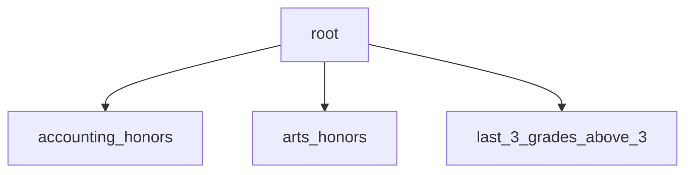
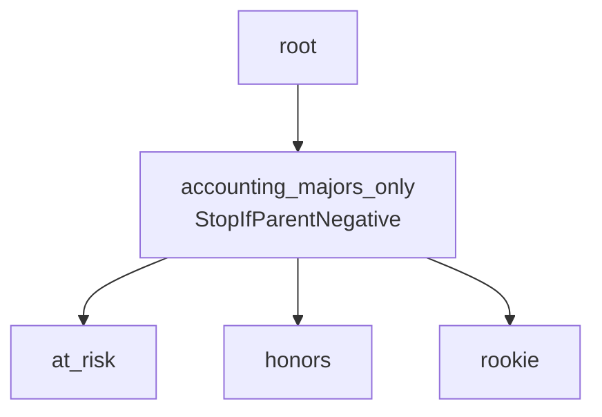
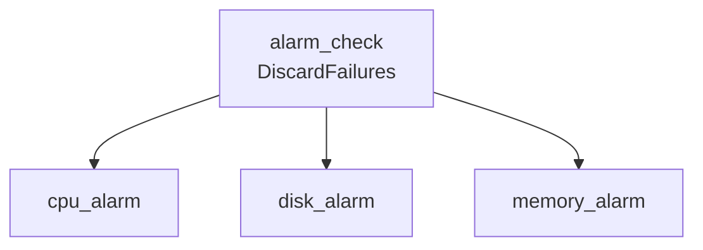
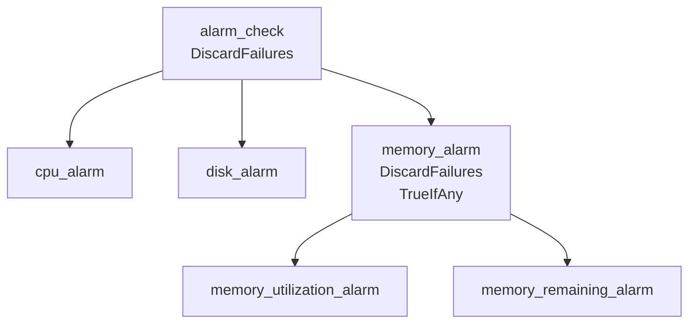

# Indigo Guide

Indigo is a rules engine created to enable application developers to build systems whose logic can be controlled by end-users via rules. Rules are expressions (such as ``"a > b"``) that are evaluated, and the outcomes used to direct appliation logic. Indigo does not itself provide a language for expressions, relying instead on a backend compiler (```interface ExpressionCompiler```) and evaluator (```interface ExpressionEvaluator```) to provide that. You can create your own backend evaluator, or use the default one, Google's Common Expression Language, CEL.

The purpose of the guide is to describe how Indigo's rules and the evaluation engine works. We encourage you to read the Indigo source code and examples as primary material, and consider this document as a companion to guide you through the concepts.

Useful links

- [Indigo examples](example_test.go)
- [CEL examples](cel/example_test.go)

- [CEL Codelabs](https://codelabs.developers.google.com/codelabs/cel-go#0)

***

[1. Introduction](#1-introduction)

   1. What is a rule?
   1. Why use rules?
   1. Expressions and rules in Indigo

[2. Expression Evaluation](#2-expression-evaluation)

   1. Compilation and Evaluation
   1. Schemas
   1. Data Types
   1. Boolean Scalar Expressions
   1. Operators
   1. Creating a Rule
   1. Compilation
   1. Input Data
   1. Evaluation
   1. Evaluation Results
   1. Short Circuit Evaluation

[3. Indigo Rules Engine Types](#3-indigo-rules-engine-types)

   1. The Engine type
   1. The Rule type

[4. Lists and Maps](#4-lists-and-maps)

   1. Lists
   1. Maps
   1. Using the 'in' operator

[5. Macros and Functions](#5-macros-and-functions)

[6. Using Protocol Buffers in Rules](#6-using-protocol-buffers-in-rules)

   1. Rules using protocol buffer types
   1. Field names in rule expressions
   1. Nested fields
   1. Enums
   1. Referring to protocol buffer types in rule expressions
   1. Oneofs

[7. Timestamps and Durations](#7-timestamps-and-durations)

   1. Rules with timestamps and durations
   1. Calculations on timestamps and durations
   1. Summary of timestamp operations in Go
   1. Timestamp conversion in a CEL rule
   1. Summary of duration operations in Go
   1. Duration conversion in a CEL rule
   1. Parts of time

[8. Object Construction](#8-object-construction)

   1. Conditional object construction

[9. Processing Multiple Rules with Indigo](#9-processing-multiple-rules-with-indigo)

   1. Manually processing multiple rules
   1. The Indigo way
   1. Parent and child rules
   1. Modifying rules
   1. Structuring rule hierarchies for updates
   1. Visualizing rules
   1. The Rule struct
   1. The Results struct

[10. Evaluation Options](#10-evaluation-options)

   1. Setting Options
   1. TrueIfAny
   1. StopIfParentNegative
   1. StopFirstNegativeChild, StopFirstPositiveChild
   1. SortFunc
   1. DiscardPass, FailAction

[11. Rule Structure and Use Cases](#11-rule-structure-and-use-cases)

   1. Which of these rules are true?

[12. Parallel Rule Evaluation](#12-parallel-rule-evaluation)

   1. Enabling Parallel Evaluation
   1. Limitations

[13. Sharding](#13-sharding)

[14. Vaults](#14-vaults)

[Appendix: More CEL Resources](#appendix-more-cel-resources)

</br>
</br>

***
</br>

# 1. Introduction

## What is a rule?

A rule is an expression that can be evaluated to produce an outcome. The outcome may be true or false, or it may be a number, or a string or any other value. The same can be said of any computer language code, but what makes rules different is that their expression language is "configurable" by end users of the software, allowing users (not developers) to modify how the software works without re-compiling or re-deploying the software.

Rules are data fed into the software, and the software processes the rules.

Consider these two equivalent rules, one written in Go, the other in a simplified "rule expression language":

##### Rule in Go

```go
  func qualify(x int) bool {
    if x > 10 {
      return true
    } else {
      return false
 }
  }
```

If the business logic changes, and instead of x > 10 we want x > 15, the Go program must be changed and recompiled. Of course, we could make the value a parameter, but what if instead of simply comparing x to a value, we also want to compare y to another value? We will have to continue changing the qualify function.

##### Rule in Expression Language

```go
x > 10
```

In the rule language example, we have an expression entered by the user at run-time as a string, and evaluated by the software. We are assuming that the software knows how to interpret the expression and produce a true/false result. If the logic changes, the user can change the rule at run-time without changing the software.

## Why use rules?

Rules are not appropriate for all situations. For one thing, rules are much slower to evaluate than compiled code. Rules are also more difficult to debug, and because users are able to enter them into the software, they are less predictable than thoroughly tested, quality software.

So why use them? The primary reason to use rules is that they allow business logic to be configured outside of the software itself. It removes business logic from the software, and makes the software into a data processing *platform*, where the rules are the *data*.

A side benefit of using rules in software is that it changes the way engineers think about writing the application. Instead of focusing on the specific business logic that must be implemented, engineers instead think about how to enable *configurable*, *dynamic* business logic that users control.

## Expressions and rules in Indigo

The Indigo rules engine goes beyond evaluating individual expressions (such as the "rule expression language" example above) and provides a structure and mechanisms to evaluate *groups* of rules arranged in specific ways for specific purposes. Indigo "outsources" the actual expression evaluation to Google's Common Expression Language, though other languages can be plugged in as well.

## General approach to using rules

You can think of Indigo as a "filter" or a "true/false" checker. You prepare a record with data you want to check, send the record to Indigo, and Indigo will tell you if the record meets the requirements of the rule. Let's say you have 100 students, and you want to determine which students need to take at least 1 language course to graduate. You would set up your rule, then call Indigo for **each** of the 100 students, one by one. As we go through this guide, it's important to understand that it is a very simple process: send the 1 record to Indigo, get the answer, proceed. There is no magic here!

</br>
</br>

***
</br>

# 2. Expression Evaluation

We start by looking at how to evaluate individual expressions. In this section we will use the terms "expression" and "rule" interchangeably. Later in this guide we will consider ways to arrange rules in hierarchies for different purposes.

All of examples use [Google's Common Expression Language](https://github.com/google/cel-go), CEL for short.

**Note:** In this guide we will touch on the basics of the language, for complete coverage you should read the [CEL language spec](https://github.com/google/cel-spec/blob/master/doc/langdef.md).

> See the `cel/example_test.go` file's `Example_basic()` function for the code used in the examples.

## Compilation and Evaluation

Indigo supports two-step processing of rules. The first step, compilation, is performed only once, when the rule is created or changed. The second step, evaluation, is performed whenever the software has new data to check against the rule.

During compilation the rule syntax, functions and data types are checked to ensure the expression is correct. The string is then transformed into an abstract syntax tree that the evaluator will later use to perform the evaluation. The engine only performs the compilation once, but can then evaluate the rules millions of times after.

## Input Data

In our simple rule example from the introduction, the 'x' was the input data:

```go
x > 10
```

In order to evaluate the rule, we had to provide the value of x in our "real" world.

In reality, rules may have many pieces of data, such as in this expression:

```go
x > 10 && y != "blue" 
```

Indigo allows you to pass a list of data elements to evaluation.

## Schemas

One of the strengths of CEL is that it provides type safe rule expressions, and violations of type safety is detected at compile time. This is very useful, since rule-writers get immediate feedback on the validity of their rules.

Building on our x and y example above , we have to define that in the *schema* for rules that use ``x`` and ``y``, ``x`` is an integer and ``y`` is a string.

In Indigo, the indigo.Schema type is used to specify the schema:

```go
// cel/example_test.go:Example_basic()
schema := indigo.Schema{
 Elements: []indigo.DataElement{
  {Name: "x", Type: indigo.Int{}},
  {Name: "y", Type: indigo.String{}},
 },
}
```

The schema is a list of indigo.DataElements. Each data element has a Name, which is the **variable** name that users will use in rule expressions.

Every rule needs to have a schema, **but a schema can be used by many rules**. As we will see later when evaluating multiple rules, each rule must use the same or compatible schemas.

### Data types

The data types supported by Indigo are in the `schema.go` file:

- String
- Integer
- Float
- Bool
- Duration
- Timestamp
- Lists
- Maps
- Proto

Proto is the only type that can have a "nested" structure, similar to a Go struct. Go structs are not supported.

### Output Schema

Just as we specify the data types of the input to the rule, we can also specify the data type we expect as a result of rule evaluation. Unlike input schemas which can have many types, the output schema is a single type, and the default is boolean.

During compilation CEL will verify that the expression produces the type of output you specified in your output schema.

You specify the output type by setting the ``ResultType`` field on the rule.

#### Exercises

Modify the example `cel/example_test.go:Example_basic()` and run ``go test`` in the ``cel`` directory.

1. Change the declared data type of `x` to a boolean
1. Change the ResultType of the rule to a string

## Boolean Scalar Expressions

The simplest type of rule compares scalar values to each other to produce a true/false outcome.
Our simple x and y rule is such an expression:

```go
x > 10 && y != "blue" 
```

In some rule engine languages you specify two parts: "if" and "then", like this:

```go
// pseudo-code for a fake rule engine language
if 
   x > 10 && y != "blue" 
then 
   set output = true 
```

CEL derives the value of the output from the value of the expression, in this case a boolean, so the "if/then" construct is not needed. (CEL does support the if/then functionality with the :? operators which we will cover later in the book.)

## Operators

Supported logical operators: ``&& || !``. Parentheses can be used to group expressions.

Supported comparison operators: `` < <= >= > == != in ``

Supported math operators: `` + - * / % ``

## Creating a rule

An Indigo rule is a Go struct, so it can be created like this:

```go
// cel/example_test.go:Example_basic()
rule := indigo.Rule{
 Schema:     schema,
 ResultType: indigo.Bool{},
 Expr:       `x > 10 && y != "blue"`,
}
```

This initializes the rule, sets its schema, the expected output (boolean) and the expression to evaluate. Indigo defaults the result type to boolean if you don't specify one.

There is also a convenience function called indigo.NewRule, which also initializes a map of child rules. We'll get to child rules later.

## Compilation

Before compiling the rule, we need to create an instance of indigo.DefaultEngine:

```go
// cel/example_test.go:Example_basic()
engine := indigo.NewEngine(cel.NewEvaluator())
```

This creates a new engine that will use CEL as its expression evaluation language. See the section on Indigo rules engine types for language evaluators and how the Indigo interface types work.

With an engine, we can now compile the rule:

```go
// cel/example_test.go:Example_basic()
err := engine.Compile(&rule)
if err != nil {
 fmt.Println(err)
 return
}
```

If there are any compilation errors, the returned error message will tell you what the error is, and where in your expression the error occurred.

For example, here's an invalid rule and the corresponding compilation error message:

```go


x > 10 && z != "blue"`,


rule : checking rule:
ERROR: <input>:1:11: undeclared reference to 'z' (in container '')
 | x > 10 && z != "blue"
 | ..........^
```

## Input Data

Now that we have a compiled rule, we can start to evaluate data against it. Let's assume we are serving an API that receives data, and it's our job to check the data against the rule and report the results.

We prepare the data for evaluation like this:

```go
// cel/example_test.go:Example_basic()
data := map[string]interface{}{
 "x": 11,
 "y": "red",
}
```

The data is placed in a map, where the **key** is the variable **name** you specified in the schema. The variables names are arbitrary, they have no connection to types or other structures. If we look back at the schema definition from earlier in this section, you'll see that we defined an "x" and a "y" variable:

```go
// Flashback to the schema definition earlier in this section
schema := indigo.Schema{
 Elements: []indigo.DataElement{
  {Name: "x", Type: indigo.Int{}},
  {Name: "y", Type: indigo.String{}},
 },
}
```

A data map does not need to define values for all variables in a schema, but if a variable is used in a rule, it must be in the data map.

## Evaluation

We are finally ready to evaluate the input data (x=11, y=red) against the rule to determine if the rule is true or false:

```go
results, err := engine.Eval(context.Background(), &rule, data)
if err != nil {
 fmt.Println(err)
 return
}
fmt.Println(results.ExpressionPass)

// Output: true
```

The evaluation returns an ``indigo.Result struct``, and an error. It is not an error if the rule returns false; an error is an unexpected issue, such as incorrect data passed.

Eval accepts a context.Context, and will stop evaluation if the context's deadline expires or is canceled, returning no results and the context's error.

## Evaluation Results

The ``indigo.Result`` struct contains the output of the expression evaluation, and additional information to help calling code process the results. For now, we'll focus on the boolean ``Result.ExpressionPass`` field. This field will tell you if the output of the expression is true or false, which is what we are interested in our example. Later we will look more in depth at the Results type.

## Short Circuiting

Many languages, including Go, implement and/or short-circuiting.

For example, in this statement, the comparison ``b == "blue"`` will never be executed:

```go
var a *int 
b := "red"

if a!=nil && b == "blue" {
...
}
```

CEL also implements short circuiting, but even allows for a!=nil to be the second clause of an && comparison. See the [table](https://github.com/google/cel-go/blob/master/README.md#partial-state) for examples.

#### Exercises

Modify the example `cel/example_test.go:Example_basic()` and run ``go test`` in the ``cel`` directory.

1. Comment out the input value for y
   Notice the error message, what does it mean?

1. Change the input value of x to 7
   Why did this not give an error message? (Although we got false when we wanted true)

</br>
</br>

***
</br>

# 3. Indigo Rules Engine Types

This section is a deeper dive into how Indigo is organized. Knowing this will make it easier to understand how to use Indigo in a larger application.

## The Engine Types

Indigo's rules engine is specified by an interface called Engine, which is composed of two interfaces, a Compiler and an Evaluator. The Compiler interface specifies the Compile method, and Evaluator specifies the Eval method.

The DefaultEngine struct type implements the Engine interface, and most users will use this type. Since it implements Engine, DefaultEngine implements both Compile and Evaluate. Alternate implementations are possible, including rule evaluators that do not support compilation, for example.

The engine types are concerned with processing groups of rules organized in a hierarchies. The engine types **do not** concern themselves with the exact nature of the expressions being compiled or evaluated. Instead, they rely on the expression types for that.

## The Expression Types

There are two expression interfaces, ExpressionEvaluator, which specifies the evaluation of a single expression, and ExpressionCompiler, which specifies the compilation of a single expression.

These two interfaces are combined in the ExpressionCompilerEvaluator.

The indigo/cel.Evaluator implements the ExpressionCompilerEvaluator.

Users of Indigo do not need to interact directly with expression compilation or evaluation; the DefaultEngine handles this.

## Rule ownership

Rules are owned by the Go code that calls Indigo engine methods. The indigo.DefaultEngine does **not** store or maintain rules. It is the responsibility of the calling code to be goroutine-safe and to persist rule data for as long as it is needed in the life of the application.

During compilation, an Engine may update a rule by setting the Program field to the compilation output of the rule. The Engine may require that data later during the evaluation phase. It is the responsibility of the calling code to ensure that the Program data is not modified, and that if the rule expression is changed, the rule must be recompiled.

## Using a Non-CEL Evaluator

There are several Go implementations of scripting languages, such as Javscript implemented by [Otto](https://github.com/robertkrimen/otto), and Lua. These languages are good choices for rule evaluation as well.

To illustrate how Indigo's interface types work together, here's how you could implement and use a different evaluator such as Otto:

1. In your own module, create a new struct, ``MyEvaluator``
1. Decide if the language requires compilation; if it does, implement the ExpressionCompiler interface, including converting types from Indigo types to the evaluator's types.
1. Implement the ExpressionEvaluator interface
1. When instantiating indigo.DefaultEngine, pass ``MyEvaluator``

Now, when you call indigo.DefaultEngine.Compile or .Evaluate, it will use your evaluator with your expression language.

</br>
</br>

***
</br>

# 4. Lists and Maps

In [section 2](#2-expression-evaluation), we saw how to use scalar values in input data and rule evaluation. Indigo also supports lists and maps in the expression language. These types function much the same as Go slices and maps.

## Lists

Below is an example of how to define a list, pass a list in the input data, and how to use a list in a rule expression:

> All of the examples in this section are from cel/example_test.go:Example_list()

```go

schema := indigo.Schema{
 Elements: []indigo.DataElement{
  {Name: "grades", Type: indigo.List{ValueType: indigo.Float{}}},
 },
}

rule := indigo.Rule{
 Schema:     schema,
 ResultType: indigo.Bool{},
 Expr:       `size(grades) > 3`,
}

data := map[string]interface{}{
 "grades": []float64{3.4, 3.6, 3.8, 2.9},
}

```

As you can see in the example, when we declare the list variable "grades" in the schema, we need to specify the type of elements we're storing with the ``ValueType`` field. Any Indigo type can be a ``ValueType``.

In a rule we can access an individual element:

```go
rule.Expr = `grades[1] == 3.6`
```

With CEL [macros](https://github.com/google/cel-spec/blob/master/doc/langdef.md#macros), we can perform operations on the elements in the list. For example, the ``exists`` macro checks if any of the grades in the list are less than 3.0:

```go
rule.Expr = `grades.exists(g, g < 3.0)`
```

In the macro we define an arbitrary variable g, which will represent each element **value** in the list as CEL executes the macro.

This rule will evaluate to true, since one of the grades is 2.9.

See the [CEL documentation](https://github.com/google/cel-spec/blob/master/doc/langdef.md#macros) for more macros.

## Maps

Maps work like Go maps, where values are indexed by a key, such as a string.

> All of the examples in this section are from cel/example_test.go:Example_map()

```go
schema := indigo.Schema{
 Elements: []indigo.DataElement{
  {Name: "flights", Type: indigo.Map{KeyType: indigo.String{}, ValueType: indigo.String{}}},
 },
}

data := map[string]interface{}{
   "flights": map[string]string{"UA1500": "On Time", "DL232": "Delayed",   "AA1622": "Delayed"},
}

rule := indigo.Rule{
 Schema:     schema, ①
 ResultType: indigo.Bool{},
 Expr:       `flights.exists(k, flights[k] == "Delayed")`,
}
```

For maps we have to specify the key type as well as the value type.

In macros that operate on maps, the value (k) is the map **key**, and we can use that to access values in the map. This will return false, since UA 1500 is delayed:

```go
flights["UA1500"] == "On Time" 

```

## Using the 'in' operator

In addition to the ``exists`` macro, we can use the operator ``in`` to determine if a value is in a list, or a key is in a map.

> The sample code for this section is in [Example_in()](cel/example_test.go)

In the data we have a map and a list:

```go
data := map[string]interface{}{
 "flights": map[string]string{"UA1500": "On Time", 
               "DL232": "Delayed", "AA1622": "Delayed"},
 "holding": []string{"SW123", "BA355", "UA91"},
}

rule := indigo.Rule{
 Schema:     schema,
 ResultType: indigo.Bool{},
 Expr:       `"UA1500" in flights && "SW123" in holding`,
}

```

The rule checks if the **key** "UA1500" is in the ``flights`` map, and if the **value** "SW123" is in the ``holding`` list.

</br>
</br>

***
</br>

# 5. Macros and Functions

CEL provides macros and functions that to help us evaluate conditions other than ``==`` or ``>``.

## Macros

We have already seen one macro (`exists`), but here are some of the macros CEL provides:

- ``has`` checks if a field exists
- ``all`` will be true if all elements meet the predicate
- ``exists_one`` will be true if only 1 element matches the
- ``filter`` can be applied to a list and returns a new list with the matching elements

Macros can be chained, as in this example from the [CEL Codelabs tutorial](https://codelabs.developers.google.com/codelabs/cel-go#10):

```proto
jwt.extra_claims.exists(c, c.startsWith('group'))
    && jwt.extra_claims
       .filter(c, c.startsWith('group'))
       .all(c, jwt.extra_claims[c]
              .all(g, g.endsWith('@acme.co')))
```

See the [CEL documentation](https://github.com/google/cel-spec/blob/master/doc/langdef.md#macros) for a complete list of macros.

There is no macro to do aggregate math on lists or maps. It is recommended to do such calculations outside rule evaluation and provide the data in the input. See [this discussion](https://groups.google.com/g/cel-go-discuss/c/1Y_1APJHk0c/m/JSsKRdGeAQAJ) in the CEL group for more information.

## Functions

Functions allow us to manipulate input values to assist in evaluation. See the [CEL documentation](https://github.com/google/cel-spec/blob/master/doc/langdef.md#list-of-standard-definitions) for a complete list.

Here are a few favorites:

- ``size`` gets the length of a string, list or map
- ``contains`` checks if a string contains another string
- ``startsWith`` checks if a string begins with a prefix
- ``endsWith`` checks if a string ends with a suffix
- ``matches`` matches a string against a regular expression

There are also functions related to types, such as:

- ``type`` returns the type of the value
- ``string`` converts an int or a timestamp to a string

CEL comes with [extension functions](https://github.com/google/cel-go/tree/master/ext) that can be enabled as well, adding more string functions, for example.

We'll cover functions related to timestamps and durations later.

</br>
</br>

***
</br>

# 6. Using Protocol Buffers in Rules

Until now all of our rules have operated on simple values, either as individual variables (numbers, strings) or as lists of such simple values. Missing from Indigo and CEL is the ability to use Go structs as input data. (An experimental implementation of struct-support exists in Indigo, but is not recommended).

Instead, CEL provides support for using Protocol Buffer types in rules. This opens more possibilities for organizing data we pass to rules. If our application serves gRPC APIs, and defines its types with protocol buffers, we can seamlessly pass protocol buffers from our Go code to Indigo rules (and the reverse, as we'll see later).

The design decisions made in CEL are congruent with those made by protocol buffers, and this is not an accident. CEL natively supports ``google.protobuf.Timestamp`` and ``google.protobuf.Duration``. We'll see more about that later.

See the [CEL documentation](https://github.com/google/cel-spec/blob/master/doc/langdef.md#protocol-buffer-data-conversion) for how protocol buffers are converted into CEL's internal representation.

To use create protocol buffer definitions and generate the code for them, follow Google's tutorial [here](https://developers.google.com/protocol-buffers/docs/gotutorial). In the rest of the guide we'll assume you have a working knowledge of protocol buffers.

After you've defined your protocol buffers and imported the generated package into your Go code, you can declare an Indigo schema with a protocol buffer type.

Indigo includes a sample protocol buffer [student.proto](../testdata/proto/student.proto), used in all the examples.

```proto
syntax = "proto3";
package testdata.school;

option go_package = "github.com/ezachrisen/indigo/testdata/school;school";

import "google/protobuf/timestamp.proto";
import "google/protobuf/duration.proto";

message Student {
  double id = 1;
  int32 age = 2;
  double gpa = 3;
  status_type status = 4;
  google.protobuf.Timestamp enrollment_date = 7; 
  
  enum status_type {
 ENROLLED = 0;
 PROBATION = 1;
  }
  
  map<string, string> attrs = 6;
  
  repeated double grades = 5;

  message Suspension {
 string cause = 1;
 google.protobuf.Timestamp date = 2;
  }

  repeated Suspension suspensions = 8;
}

message StudentSummary {
  double gpa = 1;
  double risk_factor = 2;
  google.protobuf.Duration tenure = 3;
}

```

A few things to note about this protocol buffer definition:

- It has timestamps (an imported type)
- It has durations (an imported type)
- It has enumerations
- It has maps and lists
- It has an embedded message type

Generally, you can assume that any valid protocol buffer can be used in an Indigo rule.

## Rules using protocol buffer types

Rules using protocol buffer types work exactly like rules with simple types such as strings and numbers.

> The code in this section is from cel/example_test.go:Example_protoBasic

In some ways, using protocol buffers instead of native Go types is easier, because in the schema declaration we simply provide an instance of the protocol buffer type we want to use in the ``indigo.Proto`` type. We do not have to specify each field inside the protocol buffer, or the type of values in lists and maps. Nor do we need to define any nested structs or imported types. The protocol buffer definition itself takes care of this for us:

```go
education := indigo.Schema{
  Elements: []indigo.DataElement{
   {Name: "student", Type: indigo.Proto{Message: &school.Student{}}},
  },
}
data := map[string]interface{}{
  "student": &school.Student{
   Age: 21,
  },
}

rule := indigo.Rule{
  Schema: education,
  Expr:   `student.age > 21`,
}

// Output: false
```

When we declare the schema we provide the address of an instance of the protocol buffer type (``&school.Student{}``). This means that the code that declares a schema has to have access to the generated code. (Later we'll see how to dynamically load protocol buffer types).

## Field names in rule expressions

In the Go code (where we define the data map), the field ``Age`` is capitalized. That's because protocol buffers are rendered as Go structs where all fields are exported. However, **inside** the rule expression, ``age`` is lower case. That is because **inside** rule expressions, the names are the names used in the ``.proto`` file. So, the field ``enrollment_date`` will be ``EnrollmentDate`` in Go, but ``enrollment_date`` in rule expressions.

## Nested fields

The Student protocol buffer includes a nested field, ``suspensions``, which is a list of objects of the ``Suspension`` protocol buffer type. To access these elements, we don't need to do anything special:

> The sample code is from cel/example_test.go:Example_protoNestedMessages()

```go
education := indigo.Schema{
  Elements: []indigo.DataElement{
   {Name: "x", Type: indigo.Proto{Message: &school.Student{}}}},
}

data := map[string]interface{}{
  "x": &school.Student{
   Grades: []float64{3.0, 2.9, 4.0, 2.1},
   Suspensions: []*school.Student_Suspension{
    &school.Student_Suspension{Cause: "Cheating"},
    &school.Student_Suspension{Cause: "Fighting"},
   },
  },
}

// Check if the student was ever suspended for fighting
rule := indigo.Rule{
  ID:     "fighting_check",
  Schema: education,
  Expr:   `x.suspensions.exists(s, s.cause == "Fighting")`,
}

```

In this example, we've chosen the variable name ``x``, to illustrate that the variable name can be anything, and that it should not be confused with the protocol buffer type ``Student``.

In the rule, we access the list of suspensions, then iterate through them and check if the cause for the suspension was fighting. Again, note that inside the rule, the names used are the **protocol buffer field names**.

## Enums

Referring to protocol buffer enums in rule expressions is simple and convenient. The definition of ``Student`` included an enum (``status_type``) and a field on the ``Student`` called ``status`` of type ``status_type``. The relevant parts of the protocol buffer definition are repeated here:

```proto
package testdata.school;
...

message Student {
  ...
  status_type status = 4;
  ...
  enum status_type {
 ENROLLED = 0;
 PROBATION = 1;
  }
  ...
}
```

We can use the name of the enum value directly in the expression. So instead of using 0 for the ENROLLED state, we can use the enum constant name:

> The sample code is from [Example_protoEnum()](cel/example_test.go)

```go

rule := indigo.Rule{
 Schema: education,
 Expr:   `student.status == testdata.school.Student.status_type.PROBATION`,
}

```

## Referring to protocol buffer types in rule expressions

To refer to the constant name, we needed to use the full name, which includes the protocol buffer **package** name ``testdata``:

```go
      testdata.school.Student.status_type.PROBATION
      |--------------|   ^          ^        ^
             ^           |          |      Enum 
             |           |          |      value 
           Proto         |          |      constant
        package name     |          |      name 
                         |          |      (value = 1)
                    The student     |
                    message         |
                    type            |
                                The enum 
                                type name 
                        
 ```

This is the way to refer to all protocol buffer types within rules.

## Oneofs

We have extended our Student definition with housing information, which can be either on or off campus:

```proto

  oneof housing_address {
 Address off_campus = 10;
 CampusAddress on_campus = 11;
  }


  message Address {
 string street = 1;
 string city = 2;
 string state = 3;
 string zip = 4;
  }


  message CampusAddress {
 string building = 1;
 string room = 2;
  }

```

We then set the oneof field in the data, and a rule that checks if the student lives in a particular building:

```go
data := map[string]interface{}{
 "student": &school.Student{
  Status: school.Student_ENROLLED,
  HousingAddress: &school.Student_OnCampus{
   &school.Student_CampusAddress{
    Building: "Hershey",
    Room:     "308",
   },
  },
 },
}

rule := indigo.Rule{
 Schema: education,
 Expr:   `has(student.on_campus) && student.on_campus.building == "Hershey"`,
}

// Output: true
```

This also demonstrates using the ``has`` macro: it checks if a field is set (exists).

</br>
</br>

***
</br>

# 7. Timestamps and Durations

CEL uses protocol buffer types for timestamps and durations, and they closely mirror the corresponding Go types (``time.Time`` and ``time.Duration``). There are also CEL functions to convert timestamp and duration strings to their protocol buffer types. Even if we don't use any protocol buffer types of our own, CEL uses proto versions of timestamps and durations. This illustrates the close relationship between CEL and protocol buffers.

## Rules with timestamps and durations

The sample ``Student`` protocol buffer type has a timestamp field, and the ``StudentSummary`` field has a duration field:

```proto
import "google/protobuf/timestamp.proto";
import "google/protobuf/duration.proto";

message Student {
...
  google.protobuf.Timestamp enrollment_date = 7; 
...
}

message StudentSummary {
...
   google.protobuf.Duration tenure = 3;
...
}

```

> The code for this example is in [Example_protoTimestampAndDurationComparison()](cel/example_test.go#432)

Our schema:

```go
 education := indigo.Schema{
  Elements: []indigo.DataElement{
   {Name: "s", Type: indigo.Proto{Message: &school.Student{}}},
   {Name: "now", Type: indigo.Timestamp{}},
   {Name: "ssum", Type: indigo.Proto{Message: &school.StudentSummary{}}},
  },
 }
```

Here we have references to the two student protocol buffer types as well as "now", which is a timestamp type. In CEL, the ``indigo.Timestamp`` type will be converted to a ``google.protobuf.Timestamp``.

The (silly) rule, which determines if the student enrolled prior to today and has been enrolled for more than 500 days:

```proto
s.enrollment_date < now
&& 
// 12,000h = 500 days * 24 hours
ssum.tenure > duration("12000h")
```

A couple of things to point out:

1. You can add comments in rules with ``//``
1. CEL includes a function ``duration`` which is equivalent to the ``time.ParseDuration`` function. There's also a ``timestamp`` function.

The data we will pass to the rule:

```go
data := map[string]interface{}{
 "s": &school.Student{
  EnrollmentDate: timestamppb.New(time.Date(2009, time.November, 10, 23, 0, 0, 0, time.UTC)),
 },
 "ssum": &school.StudentSummary{
  Tenure: durationpb.New(time.Duration(time.Hour * 24 * 451)),
 },
 "now": timestamppb.Now(),
}
```

In the ``Student`` and ``StudentSummary`` Go structs, we initialize the timestamp and duration fields with functions from the [``timestamppb``](https://pkg.go.dev/google.golang.org/protobuf/types/known/timestamppb) and [``durationpb``](https://pkg.go.dev/google.golang.org/protobuf/types/known/durationpb) packages.

Evaluating the rule returns ``false``.

## Calculations on timestamps and durations

In CEL rules we can do calculations on timestamps and durations. See [the CEL spec](https://github.com/google/cel-spec/blob/master/doc/langdef.md#list-of-standard-definitions) for the operations allowed.

We can write the following rule to determine if the student has been enrolled more than 100 days:

```proto
// 2,400h = 100 days * 24 hours
now - s.enrollment_date > duration("2400h")
```

The calculation ``timestamp - timestamp`` produces a duration, which is then compared with another duration.

Similarly, we could add a duration to a timestamp or add two durations.

## Summary of timestamp operations in Go

This package has generated types for google/protobuf/timestamp.proto:

```go
import "google.golang.org/protobuf/types/known/timestamppb"
```

To create a new proto timestamp:

```go
now := timestamppb.Now()
```

To convert a Go time.Time to a proto timestamp:

```go
prototime := timestamppb.New(time.Date(2009, time.November, 10, 23, 0, 0, 0, time.UTC))
```

To convert from a proto time to Go time:

```go
goTime := pbtime.AsTime()
```

## Timestamp conversion in a CEL rule

Convert from a string to a timestamp:

``proto
timestamp("1972-01-01T10:00:20.021-05:00")
``

## Summary of duration operations in Go

This package has generated types for google/protobuf/duration.proto:

```go
import "google.golang.org/protobuf/types/known/durationpb"
```

To convert a Go duration to a proto duration:

```go
protodur := durationpb.New(godur)
```

To convert back from a protocol buffer duration to a Go duration:

```go
goDur := protodur.AsDuration()
```

## Duration conversion in a CEL rule

``proto
duration("2400h")
``

## Parts of time

CEL provides [functions](https://github.com/google/cel-spec/blob/master/doc/langdef.md#list-of-standard-definitions) to access parts of a timestamp.

> The code for this example is in [Example_protoTimestampPart()](cel/example_test.go)

The data we want to test:

```go
data := map[string]interface{}{
  "s": &school.Student{
   EnrollmentDate: timestamppb.New(time.Date(2022, time.April, 8, 23, 0, 0, 0, time.UTC)),
  },
}
```

The rule to check if the date given is on a Friday in UTC:

```proto
s.enrollment_date.getDayOfWeek() == 5 // Friday
// Output: true 
```

``getDayOfWeek`` is zero-based (Sunday == 0).

CEL also lets us check the day of the week in whatever timezone we want:

> The code for this example is in [Example_protoTimestampPartTZ()](cel/example_test.go)

With the same input time ...

```go
data := map[string]interface{}{
  "s": &school.Student{
   EnrollmentDate: timestamppb.New(time.Date(2022, time.April, 8, 23, 0, 0, 0, time.UTC)),
  },
}
```

... it is now Saturday is India:

```proto
s.enrollment_date.getDayOfWeek("Asia/Kolkata") == 6 // Saturday
// Output: true
```

See the [reference](https://github.com/google/cel-spec/blob/master/doc/langdef.md#timezones).

We can also get parts of durations with the ``getHours()``, ``getMinutes()``, ``getSeconds()``, etc. functions.

</br>
</br>

***
</br>

# 8. Object Construction

Rather than return ``true`` or ``false`` from a rule, we can use Indigo to return any valid value, including creating a new protocol buffer object.

> The sample code for this section is in [Example_protoConstruction()](cel/example_test.go)

With our familiar education schema, our rule can now return a new object:

```go
rule := indigo.Rule{
 ID:         "create_summary",
 Schema:     education,
 ResultType: indigo.Proto{Message: &school.StudentSummary{}},
 Expr: `
  testdata.school.StudentSummary {
   gpa: s.gpa,
   risk_factor: 2.0 + 3.0,
   tenure: duration("12h")
  }`,
}
```

Here, the result of the expression is **not** a boolean, but rather a Go protocol buffer struct of with the type ``StudentSummary``.

Two important things to point out:

1. The rule's ``ResultType`` has been set to the protocol buffer type we want as the output. (What happens if we set it to boolean?)
1. To refer to the protocol buffer type in the rule expression we are using the full name, including the package name (``testdata.school.StudentSummary``)

We compile and evaluate the rule as usual, but to inspect the output we need to access the **``Value``** field of the result, not the **``ExpressionPass``** field we normally check. In the section on using the ``Result`` type we'll go into more detail, but ``Value`` holds the raw output of the rule, and ``ExpressionPass`` is always ``true``, unless the rule explicitly returns ``false``.

``Value`` is an empty interface, so we get the struct we want from it:

```go
summary := result.Value.(*school.StudentSummary)
```

(Since this is test code, we confidently perform the type assertion without checking it. Do not do this in real code.)

Once we have the summary object, we can examine it

```go
fmt.Printf("%T\n", summary)
fmt.Printf("%0.0f\n", summary.RiskFactor)

// Output: *school.StudentSummary
// 5
```
>
This example illustrates that we can get just about anything out of a rule expression. We could use it to perform a calculation (``2 + 2``), filter a list (``mylist.filter(e, e > 10)``) or get today's day in the year (``timestamp(now).getDayOfYear())``).

## Conditional object construction

Rather than simply returning an object, we could apply some condition to determine how to construct the object:

```proto
student.gpa > 3.0 ?
 testdata.school.StudentSummary {
  gpa: student.gpa,
  risk_factor: 0.0
 }
:
   testdata.school.StudentSummary {
  gpa: student.gpa,
  risk_factor: 2.0 + 3.0,
  tenure: duration("12h")
 }
```

In this rule, we use the ``? :`` [operators](https://github.com/google/cel-spec/blob/master/doc/langdef.md#logical-operators).

</br>
</br>

***
</br>

# 9. Processing Multiple Rules with Indigo

The CEL package is a fantastic open-source project supported by Google. It is used extensively in their own products, which means we get performance, quality and security for free. The language offers rich features to express most evaluation needs, and it can be extended to handle cases that aren't covered (see upcoming section on custom functions). CEL does one thing, and it does it extremely well: evaluate an expression.

However, evaluating a single expression is rarely the goal. When we use rules in an application, we want to answer questions that require us to evaluate more than 1 rule. That's where Indigo comes in.

We'll start this section by looking at what it would be like to evaluate multiple CEL expressions and handling the result manually. Then we'll use Indigo to do the same operation.

## Manually processing multiple rules

Obviously, you can manually process multiple rules and interpret the results one by one.

> The sample code for this section is in [Example_manual()](cel/example_organization_test.go)

In the example, we want to determine which communications to send to a student:

- "Congratulations, you're an accounting honors student"
- "Congratulations, you're an arts honors student"
- "Congratulations, your last three grades were 3 or above"

We'll use the same education schema as before, and create one rule for each of the possible communications:

```go
accounting_honors := indigo.Rule{
 Schema: education,
 Expr:   `s.attrs.exists(k, k == "major" && s.attrs[k] == "Accounting") && s.gpa > 3`,
}

arts_honors := indigo.Rule{
 Schema: education,
 Expr:   `s.attrs.exists(k, k == "major" && s.attrs[k] == "Arts") && s.gpa > 3`,
}

last_3_grades_3_or_above := indigo.Rule{
 Schema: education,
 Expr: `size(s.grades) >=3 
    && s.grades[size(s.grades)-1] >= 3.0 
    && s.grades[size(s.grades)-2] >= 3.0 
    && s.grades[size(s.grades)-3] >= 3.0 `,
}
```

Then, we'll compile, evaluate and inspect the results of each rule:

```go
err := engine.Compile(&accounting_honors)
if err != nil {
 fmt.Printf("Error adding rule %v", err)
 return
}

results, err := engine.Eval(context.Background(), &accounting_honors, data)
if err != nil {
 fmt.Printf("Error evaluating: %v", err)
 return
}
fmt.Println("accounting_honors?", results.ExpressionPass)

err = engine.Compile(&arts_honors)
if err != nil {
 fmt.Printf("Error adding rule %v", err)
 return
}

results, err = engine.Eval(context.Background(), &arts_honors, data)
if err != nil {
 fmt.Printf("Error evaluating: %v", err)
 return
}
fmt.Println("arts_honors?", results.ExpressionPass)

err = engine.Compile(&last_3_grades_3_or_above)
if err != nil {
 fmt.Printf("Error adding rule %v", err)
 return
}

results, err = engine.Eval(context.Background(), &last_3_grades_3_or_above, data)
if err != nil {
 fmt.Printf("Error evaluating: %v", err)
 return
}
fmt.Println("last_3_grades_above_3?", results.ExpressionPass)

// Output: accounting_honors? true
// arts_honors? false
// last_3_grades_above_3? true
```

The manual processing of individual rules works fine, but imagine that each academic department wants to set their own rules for awarding honors. We'll have 20 or 30 rules (``math_honors``, ``history_honors``, etc.), which will become difficult to manage. And if you're managing individual rules in code, you may be better off just writing the rules as Go code to begin with...

## The Indigo way

Now, let's use Indigo to organize the rules in a list:

> The sample code for this section is in [Example_indigo()](cel/example_organization_test.go)

```go
root := indigo.NewRule("root", "")
root.Schema = education

root.Rules["accounting_honors"] = &indigo.Rule{
 ID:     "accounting_honors",
 Schema: education,
 Expr:   `s.attrs.exists(k, k == "major" && s.attrs[k] == "Accounting") && s.gpa > 3`,
}

root.Rules["arts_honors"] = &indigo.Rule{
 ID:     "arts_honors",
 Schema: education,
 Expr:   `s.attrs.exists(k, k == "major" && s.attrs[k] == "Arts") && s.gpa > 3`,
}

root.Rules["last_3_grades_above_3"] = &indigo.Rule{
 ID:     "last_3_grades_above_3",
 Schema: education,
 Expr: `size(s.grades) >=3 
  && s.grades[size(s.grades)-1] >= 3.0 
  && s.grades[size(s.grades)-2] >= 3.0 
  && s.grades[size(s.grades)-3] >= 3.0 `,
}

engine := indigo.NewEngine(cel.NewEvaluator())

err := engine.Compile(root)
if err != nil {
 fmt.Printf("Error adding rule %v", err)
 return
}

results, err := engine.Eval(context.Background(), root, data)
if err != nil {
 fmt.Printf("Error evaluating: %v", err)
 return
}

for k, v := range results.Results {
 fmt.Printf("%s? %t\n", k, v.ExpressionPass)
}

// Unordered output: accounting_honors? true
// arts_honors? false
// last_3_grades_above_3? true
```

With Indigo, we create a "root" rule, with a schema but no rule expression. Then we added each child rule to the root rule's list of child rules.

We then evaluated the *root* rule, not each individual rule. ``Eval`` automatically evaluates the child rules for us.

Finally, we iterated through the list of results to determine the action for each type of communications.

With Indigo, if each department wants to have their own honors rule, it's easy: read a list of rules from a database, add them to the root rule and evaluate.

In the next few sections we'll dig deeper into the ``Rule`` and ``Results`` structs and how to visualize parent/child relationships.

## Parent and child rules

To create common ground for discussing rule structure, here are some facts about parent and child rules:

   1. A parent rule is any rule that has 1 or more children.
   1. A child rule is a rule that has a parent.
   1. A parent can be both a parent and a child.
   1. Rules can be nested to any level.
   1. Child rules are by default unsorted (but see [SortFunc](#sortfunc)).
   1. All child rules are created equal.
   1. A rule may or may not have a rule expression.
   1. Rules at any level may have options set (see [evaluation options](#10-evaluation-options)).

## Modifying rules

The calling application is responsible for managing the lifecycle of rules, including ensuring concurrency safety.

To add or remove rules, you do so by modifying the parent rule's map of Rules:

```go
delete(parent.Rules, "child-id-to-delete")
```

and

```go
myNewRule.Compile(myCompiler)
parent.Rules["my-new-rule"] = myNewRule
```

You must **not** modify a rule:

1. During compilation
1. After compilation and before evaluation
1. During evaluation
1. After evaluation and before results have been consumed

"Modification" includes updates to any field on a rule struct, including the map of child rules.

## Structuring rule hierarchies for updates

The ability to organize rules in a hierarchy is useful to ensure that rule updates are atomic and consistent.

You should structure the hierarchy so that a rule and its children can be seen as a
"transaction" as far as updates are concerned.

In this example, where Indigo is being used to enforce firewall rules, being able
to update ALL firewall rules as a group, rather than one by one (where one update may fail)
is important.

```go
Firewall Rules (parent)
  "Deny all traffic" (child 1)
  "Allow traffic from known_IPs" (child 2)
```

If the user changes child 1 to be "Allow all traffic" and changes child 2 to "Deny all traffic,
except for known_IPs", there's a risk that child 1 is changed first, without the child 2 change
happening. This would leave us with this:

```go
Firewall Rules (parent)
  "Allow all traffic" (child 1)       <-- OOPS!
  "Allow traffic from known_IPs" (child 2)
```

This is clearly bad!

Instead of accepting a change to child 1 and child 2 separately, ONLY accept a change to your rule hierarchy for the
Firewall Rules parent. That way the update succeeds or fails as a "transaction".

If Firewall Rules is itself a child of a larger set of parent rules, it's recommended to compile the
Firewall Rules parent and children BEFORE adding it to its eventual parent. That way you ensure that
if compilation of Firewall Rules fails, the "production" firewall rules are still intact.

## Visualizing rules

As you build more complex rules with child rules, it can be difficult to visualize how rules are organized. We can print the rule with ``fmt`` to see it:

```go
fmt.Println(root)

┌─────────────────────────────────────────────────────────────────────────────────────────────────┐
│                                                                                                 │
│ INDIGO RULES                                                                                    │
│                                                                                                 │
├─────────────────────────┬───────────┬──────────────────────────────────────────┬────────┬───────┤
│                         │           │                                          │ Result │       │
│ Rule                    │ Schema    │ Expression                               │ Type   │ Meta  │
├─────────────────────────┼───────────┼──────────────────────────────────────────┼────────┼───────┤
│ root                    │ education │                                          │ <nil>  │ <nil> │
├─────────────────────────┼───────────┼──────────────────────────────────────────┼────────┼───────┤
│   accounting_honors     │ education │ s.attrs.exists(k, k == "major" && s.attr │ <nil>  │ <nil> │
│                         │           │ s[k] == "Accounting")                    │        │       │
│                         │           │          && s.gpa > 3                    │        │       │
├─────────────────────────┼───────────┼──────────────────────────────────────────┼────────┼───────┤
│   arts_honors           │ education │ s.attrs.exists(k, k == "major" && s.attr │ <nil>  │ <nil> │
│                         │           │ s[k] == "Arts")                          │        │       │
│                         │           │          && s.gpa > 3                    │        │       │
├─────────────────────────┼───────────┼──────────────────────────────────────────┼────────┼───────┤
│   last_3_grades_above_3 │ education │ size(s.grades) >=3                       │ <nil>  │ <nil> │
│                         │           │          && s.grades[size(s.grades)-1] > │        │       │
│                         │           │ = 3.0                                    │        │       │
│                         │           │          && s.grades[size(s.grades)-2] > │        │       │
│                         │           │ = 3.0                                    │        │       │
│                         │           │          && s.grades[size(s.grades)-3] > │        │       │
│                         │           │ = 3.0                                    │        │       │
└─────────────────────────┴───────────┴──────────────────────────────────────────┴────────┴───────┘
```

This view is very useful for visualizing small numbers of rules.

The above is equivalent to this diagram:



## The Rule struct

Let's look at the actual ``indigo.Rule`` struct:

```go
type Rule struct {
 // A rule identifer. (required)
 ID string `json:"id"`

 // The expression to evaluate (optional)
 // The expression can return a boolean (true or false), or any
 // other value the underlying expression engine can produce.
 // All values are returned in the Results.Value field.
 // Boolean values are also returned in the results as Pass = true  / false
 // If the expression is blank, the result will be true.
 Expr string 

 // The output type of the expression. Evaluators with the ability to check
 // whether an expression produces the desired output should return an error
 // if the expression does not.
 // If no type is provided, evaluation and compilation will default to Bool
 ResultType Type 

 // The schema describing the data provided in the Evaluate input. (optional)
 // Some implementations of Evaluator require a schema.
 Schema Schema 

 // A reference to an object whose values can be used in the rule expression.
 // Add the corresponding object in the data with the reserved key name selfKey
 // (see constants).
 // Child rules do not inherit the self value.
 // See example for usage. TODO: example
 Self interface{} 

 // A set of child rules.
 Rules map[string]*Rule 

 // Reference to intermediate compilation / evaluation data.
 Program interface{} 

 // A reference to any object.
 // Not used by the rules engine.
 Meta interface{} 

 // Options determining how the child rules should be handled.
 EvalOptions EvalOptions 
}
```

## The Results struct

Just like we can print a rule to see its structure, we can also print ``results``:

```go

fmt.Println(results)

┌──────────────────────────────────────────────────────────────────────────────────────────────────────────────────────────────────────────────┐
│                                                                                                                                              │
│ INDIGO RESULT SUMMARY                                                                                                                        │
│                                                                                                                                              │
├─────────────────────────┬───────┬───────┬───────┬────────┬─────────────┬─────────┬─────────────┬────────────┬────────────┬─────────┬─────────┤
│                         │ Pass/ │ Expr. │ Chil- │ Output │ Diagnostics │ True    │ Stop If     │ Stop First │ Stop First │ Discard │ Discard │
│ Rule                    │ Fail  │ Pass/ │ dren  │ Value  │ Available?  │ If Any? │ Parent Neg. │ Pos. Child │ Neg. Child │ Pass    │ Fail    │
│                         │       │ Fail  │       │        │             │         │             │            │            │         │         │
├─────────────────────────┼───────┼───────┼───────┼────────┼─────────────┼─────────┼─────────────┼────────────┼────────────┼─────────┼─────────┤
│ root                    │ FAIL  │ PASS  │ 3     │ true   │             │         │             │            │            │         │         │
│   accounting_honors     │ PASS  │ PASS  │ 0     │ true   │             │         │             │            │            │         │         │
│   arts_honors           │ FAIL  │ FAIL  │ 0     │ false  │             │         │             │            │            │         │         │
│   last_3_grades_above_3 │ PASS  │ PASS  │ 0     │ true   │             │         │             │            │            │         │         │
└─────────────────────────┴───────┴───────┴───────┴────────┴─────────────┴─────────┴─────────────┴────────────┴────────────┴─────────┴─────────┘
```

As we can see, the structure of results mirrors the structure of the rules that were evaluated: there's a root rule with 3 child values.

The ``indigo.Results`` struct looks like this:

```go
// Result of evaluating a rule.
type Result struct {
 // The Rule that was evaluated
 Rule *Rule

 // Whether the rule is true.
 // The default is TRUE.
 // Pass is the result of rolling up all child rules and evaluating the
 // rule's own expression. All child rules and the rule's expression must be
 // true for Pass to be true.
 Pass bool

 // Whether evaluating the rule expression yielded a TRUE logical value.
 // The default is TRUE.
 // The result will not be affected by the results of the child rules.
 // If no rule expression is supplied for a rule, the result will be TRUE.
 ExpressionPass bool

 // The raw result of evaluating the expression. Boolean for logical expressions.
 // Calculations, object constructions or string manipulations will return the appropriate Go type.
 // This value is never affected by child rules.
 Value interface{}

 // Results of evaluating the child rules.
 Results map[string]*Result

 // Diagnostic data; only available if you turn on diagnostics for the evaluation
 Diagnostics *Diagnostics

 // The evaluation options used
 EvalOptions EvalOptions

 // A list of the rules evaluated, in the order they were evaluated
 // Only available if you turn on diagnostics for the evaluation
 // This may be different from the rules represented in Results, if
 // If we're discarding failed/passed rules, they will not be in the results,
 // and will not show up in diagnostics, but they will be in this list.
 RulesEvaluated []*Rule
}
```

Three fields warrant more discussion at this point: ``Pass``, ``ExpressionPass`` and ``Value``.

The simplest is ``Value``: it is always the raw output of the expression, regardless of any [evaluation options](#10-evaluation-options).

From the ``Value`` we derive ``ExpressionPass``. The value is ``true``, unless the rule explicitly returns a boolean ``false``. Again, this value is never affected by any [evaluation options](#10-evaluation-options).

The last value, ``Pass`` is more complex, because it is the result of all of the child rules *and* the parent rule's own ``ExpressionPass``, *and* it is affected by setting the [``TrueIfAny``](#true-if-any) option. It is also most valuable, because it allows you to take advantage of all of the flexibility of Indigo rules. Generally, (for boolean outcomes) you should not need to inspect ``Value`` or ``ExpressionPass`` directly, but instead use ``Pass``.

# 10. Evaluation Options

In the ``indigo.Rule`` struct, the ``indigo.EvalOptions`` field allows us to specify how to interpret the result of the root rule and child rules.

In this section we'll explain what the options are, their usage, and provide an example.

## Setting Options

Options are turned off by default. To turn them on, set them in the ``EvalOptions`` field on the rule, for example:

```go
r.EvalOptions.TrueIfAny = true 
```

## TrueIfAny

From the ``indigo.EvalOptions`` struct documentation:

```go
// TrueIfAny makes a parent rule Pass = true if any of its child rules are true.
// The default behavior is that a rule is only true if all of its child rules are true, and
// the parent rule itself is true.
// Setting TrueIfAny changes this behvior so that the parent rule is true if at least one of its child rules
// are true, and the parent rule itself is true.
TrueIfAny bool `json:"true_if_any"`
```

The effect of setting this on a parent rule is to turn it into an "OR" rule. If we look back at our example with the 3 communications options (honors accounting, honors arts, etc.), we'll see that the root rule is marked as ``FAIL``. That's because although its ``ExpressionPass`` is ``PASS``, one of the child rules (``arts_honors``) is ``FAIL``. This failed rule also makes the parent (root) rule ``FAIL``.

When using the ``TrueIfAny`` option you may want to set the [``StopFirstPositiveChild``](#stopfirstnegativechild-stopfirstpositivechild) option as well.

```go
   ┌──────────────────────────────────────────────────────────────────────────────────────────────────────────────────────────────────────────────┐
   │                                                                                                                                              │
   │ INDIGO RESULT SUMMARY                                                                                                                        │
   │                                                                                                                                              │
   ├─────────────────────────┬───────┬───────┬───────┬────────┬─────────────┬─────────┬─────────────┬────────────┬────────────┬─────────┬─────────┤
   │                         │ Pass/ │ Expr. │ Chil- │ Output │ Diagnostics │ True    │ Stop If     │ Stop First │ Stop First │ Discard │ Discard │
   │ Rule                    │ Fail  │ Pass/ │ dren  │ Value  │ Available?  │ If Any? │ Parent Neg. │ Pos. Child │ Neg. Child │ Pass    │ Fail    │
   │                         │       │ Fail  │       │        │             │         │             │            │            │         │         │
   ├─────────────────────────┼───────┼───────┼───────┼────────┼─────────────┼─────────┼─────────────┼────────────┼────────────┼─────────┼─────────┤
-->│ root                    │>FAIL  │ PASS  │ 3     │ true   │             │         │             │            │            │         │         │
   │   accounting_honors     │ PASS  │ PASS  │ 0     │ true   │             │         │             │            │            │         │         │
   │   arts_honors           │ FAIL  │ FAIL  │ 0     │ false  │             │         │             │            │            │         │         │
   │   last_3_grades_above_3 │ PASS  │ PASS  │ 0     │ true   │             │         │             │            │            │         │         │
   └─────────────────────────┴───────┴───────┴───────┴────────┴─────────────┴─────────┴─────────────┴────────────┴────────────┴─────────┴─────────┘
```

Let's change the root rule to ``TrueIfAny``:

```go

root.EvalOptions.TrueIfAny = true

```

The root now passes:

```go
   ┌──────────────────────────────────────────────────────────────────────────────────────────────────────────────────────────────────────────────┐
   │                                                                                                                                              │
   │ INDIGO RESULT SUMMARY                                                                                                                        │
   │                                                                                                                                              │
   ├─────────────────────────┬───────┬───────┬───────┬────────┬─────────────┬─────────┬─────────────┬────────────┬────────────┬─────────┬─────────┤
   │                         │ Pass/ │ Expr. │ Chil- │ Output │ Diagnostics │ True    │ Stop If     │ Stop First │ Stop First │ Discard │ Discard │
   │ Rule                    │ Fail  │ Pass/ │ dren  │ Value  │ Available?  │ If Any? │ Parent Neg. │ Pos. Child │ Neg. Child │ Pass    │ Fail    │
   │                         │       │ Fail  │       │        │             │         │             │            │            │         │         │
   ├─────────────────────────┼───────┼───────┼───────┼────────┼─────────────┼─────────┼─────────────┼────────────┼────────────┼─────────┼─────────┤
-->│ root                    │>PASS  │ PASS  │ 3     │ true   │             │ yes     │             │            │            │         │         │
   │   accounting_honors     │ PASS  │ PASS  │ 0     │ true   │             │         │             │            │            │         │         │
   │   arts_honors           │ FAIL  │ FAIL  │ 0     │ false  │             │         │             │            │            │         │         │
   │   last_3_grades_above_3 │ PASS  │ PASS  │ 0     │ true   │             │         │             │            │            │         │         │
   └─────────────────────────┴───────┴───────┴───────┴────────┴─────────────┴─────────┴─────────────┴────────────┴────────────┴─────────┴─────────┘
```

This is useful because we now have a simple way of determining if we have to send out any communications: check the root rule's ``Pass`` field.

There are many other uses for this, such as in security rules, put a list of reasons to **allow** a user action in the child rules; allow the action if root passes.

## StopIfParentNegative

This option prevents the evaluation of child rules if the parent's expression is false. This is used to save evaluation time by "lifting" common exclusionary rules up to a parent level, so that we can skip evaluating the child rules if there is zero chance they will pass. This is particularly useful if the common rule clause is expensive to evaluate.

> The sample code for this section is in [Example_stopIfParentNegative()](cel/example_organization_test.go)

In this example, we're going to evaluate 3 rules, (honors, at_risk and rookie), but we only want to do that for Accounting majors. Imagine that the university as 30,000 students and 10 of them are accounting majors. Obviously, evaluating all 3 rules for every student would be silly.

Instead we make a parent rule, called ``accounting``, where we put the major requirement. We then put the 3 rules as child rules of the accounting rule.

Finally, we set the ``StopIfParentNegative`` flag on the accounting parent rule:

```go


 root := indigo.NewRule("root", "")
 root.Schema = education
 accounting := indigo.NewRule("accounting_majors_only", `s.attrs.exists(k, k == "major" && s.attrs[k] == "Accounting")`)
 accounting.Schema = education
 accounting.EvalOptions.StopIfParentNegative = true

 root.Rules[accounting.ID] = accounting

 accounting.Rules["honors"] = &indigo.Rule{
  ID:     "honors",
  Schema: education,
  Expr:   "s.gpa > 3.0",
 }

 accounting.Rules["at_risk"] = &indigo.Rule{
  ID:     "at_risk",
  Schema: education,
  Expr:   "s.gpa < 2.0",
 }

 accounting.Rules["rookie"] = &indigo.Rule{
  ID:     "rookie",
  Schema: education,
  Expr:   "s.credits < 5",
 }
```

The ``accounting_majors_only`` rule is expensive to evaluate: it needs to iterate over all keys in the ``attrs`` map. By only evaluating it once, we'll save some time. It also makes the child rules simpler: they do not need to incorporate a major check, instead they focus on their specific rule expression.

The rule structure is like this:

```go

┌──────────────────────────────────────────────────────────────────────────────────────────────────┐
│                                                                                                  │
│ INDIGO RULES                                                                                     │
│                                                                                                  │
├──────────────────────────┬───────────┬──────────────────────────────────────────┬────────┬───────┤
│                          │           │                                          │ Result │       │
│ Rule                     │ Schema    │ Expression                               │ Type   │ Meta  │
├──────────────────────────┼───────────┼──────────────────────────────────────────┼────────┼───────┤
│ root                     │ education │                                          │ <nil>  │ <nil> │
├──────────────────────────┼───────────┼──────────────────────────────────────────┼────────┼───────┤
│   accounting_majors_only │ education │ s.attrs.exists(k, k == "major" && s.attr │ <nil>  │ <nil> │
│                          │           │ s[k] == "Accounting")                    │        │       │
├──────────────────────────┼───────────┼──────────────────────────────────────────┼────────┼───────┤
│     at_risk              │ education │ s.gpa < 2.0                              │ <nil>  │ <nil> │
├──────────────────────────┼───────────┼──────────────────────────────────────────┼────────┼───────┤
│     rookie               │ education │ s.credits < 5                            │ <nil>  │ <nil> │
├──────────────────────────┼───────────┼──────────────────────────────────────────┼────────┼───────┤
│     honors               │ education │ s.gpa > 3.0                              │ <nil>  │ <nil> │
└──────────────────────────┴───────────┴──────────────────────────────────────────┴────────┴───────┘

```



When we evaluate it for an Accounting major, we get this result:

```

┌───────────────────────────────────────────────────────────────────────────────────────────────────────────────────────────────────────────────┐
│                                                                                                                                               │
│ INDIGO RESULTS                                                                                                                                │
│                                                                                                                                               │
├──────────────────────────┬───────┬───────┬───────┬────────┬─────────────┬─────────┬─────────────┬────────────┬────────────┬─────────┬─────────┤
│                          │ Pass/ │ Expr. │ Chil- │ Output │ Diagnostics │ True    │ Stop If     │ Stop First │ Stop First │ Discard │ Discard │
│ Rule                     │ Fail  │ Pass/ │ dren  │ Value  │ Available?  │ If Any? │ Parent Neg. │ Pos. Child │ Neg. Child │ Pass    │ Fail    │
│                          │       │ Fail  │       │        │             │         │             │            │            │         │         │
├──────────────────────────┼───────┼───────┼───────┼────────┼─────────────┼─────────┼─────────────┼────────────┼────────────┼─────────┼─────────┤
│ root                     │ FAIL  │ PASS  │ 1     │ true   │             │         │             │            │            │         │         │
│   accounting_majors_only │ FAIL  │ PASS  │ 3     │ true   │             │         │ yes         │            │            │         │         │
│     at_risk              │ FAIL  │ FAIL  │ 0     │ false  │             │         │             │            │            │         │         │
│     rookie               │ FAIL  │ FAIL  │ 0     │ false  │             │         │             │            │            │         │         │
│     honors               │ PASS  │ PASS  │ 0     │ true   │             │         │             │            │            │         │         │
└──────────────────────────┴───────┴───────┴───────┴────────┴─────────────┴─────────┴─────────────┴────────────┴────────────┴─────────┴─────────┘

```

The ``accounting_majors_only`` expression is true, and so the three child rules are also evaluated.

If we evaluate the rules for a Computer Science major, we get this:

```

┌───────────────────────────────────────────────────────────────────────────────────────────────────────────────────────────────────────────────┐
│                                                                                                                                               │
│ INDIGO RESULTS                                                                                                                                │
│                                                                                                                                               │
├──────────────────────────┬───────┬───────┬───────┬────────┬─────────────┬─────────┬─────────────┬────────────┬────────────┬─────────┬─────────┤
│                          │ Pass/ │ Expr. │ Chil- │ Output │ Diagnostics │ True    │ Stop If     │ Stop First │ Stop First │ Discard │ Discard │
│ Rule                     │ Fail  │ Pass/ │ dren  │ Value  │ Available?  │ If Any? │ Parent Neg. │ Pos. Child │ Neg. Child │ Pass    │ Fail    │
│                          │       │ Fail  │       │        │             │         │             │            │            │         │         │
├──────────────────────────┼───────┼───────┼───────┼────────┼─────────────┼─────────┼─────────────┼────────────┼────────────┼─────────┼─────────┤
│ root                     │ FAIL  │ PASS  │ 1     │ true   │             │         │             │            │            │         │         │
│   accounting_majors_only │ FAIL  │ FAIL  │ 0     │ false  │             │         │ yes         │            │            │         │         │
└──────────────────────────┴───────┴───────┴───────┴────────┴─────────────┴─────────┴─────────────┴────────────┴────────────┴─────────┴─────────┘


```

``ExpressionPass`` is false for the ``accounting_majors_only`` rule, hence none of the child rules were evaluated (they do not appear in the list of rules in the results).

## StopFirstNegativeChild, StopFirstPositiveChild

The ``StopFirstNegativeChild`` option stops evaluating child rules when we encounter the first rule that evaluates to false. The option considers the ``indigo.Result.Pass`` field, not the ``indigo.Result.ExpressionPass`` field, so child results are used recursively.  Recall that the ``Pass`` field takes into account the results of a rule's children, whereas ``ExpressionPass`` does not.

The ``StopFirstPositiveChild`` works the same way, except for stopping when a true result is found.

We haven't discussed *evaluation order* until now, because it hasn't yet mattered. In all of our evaluation examples so far we have evaluated all child rules. By default the order in which child rules are evaluated is undefined and will vary from execution to execution. (Remember that child rules are stored in a map, and map keys in Go are unordered.) To determine the order in which rules are evaluated, you specify the [SortFunc](#sortfunc) option on the parent rule. More on that option later.

If you require all child rules to be true, it may be a good idea to use the ``StopFirstNegativeChild`` option, since the moment you find a false there's no reason to continue evaluating rules. This is efficient for making a decision.

However, since the rest of the rules are not evaluated after the first false, you won't know how many of them were true or false. If the users need to know which rules passed and failed, it's not a good idea to stop evaluation.

Example uses of the ``StopFirstNegativeChild`` option:

- An API server needs to quickly decide to allow or disallow an action (child rules with all required conditions)
- A self-driving car should apply emergency braking immediately if one of the emergency braking conditions is met

Any negative rule can be turned into a positive rule, so the ``StopFirstPositiveChild`` optiob has similar use case examples.

## SortFunc

When the ``StopFirstNegativeChild`` or ``StopFirstPositiveChild`` options are set, the order in which rules are evaluated **may** be important. If you only care that a rule passed or failed, and so you take an action because of that, the order may not matter.

Let's say we have 1,000 child rules, each rule has a different probability of being false. For example, rule X is false for 1 in 20 records, but rule Y is false for only 1 in 1,000 records. If we require all 1,000 rules to be true for an action to take place, finding the first false rule as quickly as possible could give us a good performance boost.

We can do this by sorting rules by probability of failing, high to low. You could further imagine that the probabilities of failing are constantly adjusted as new data becomes available. In this way, we can dynamically adjust the evaluation of rules.

Instead of implementing a machine learning algorithm, we'll look at a simpler example to illustrate the use of ``SortFunc``: evaluating rules in alphabetical order.

> The sample code for this section is in [ExampleSortFunc()](example_test.go)

```go

// r is a rule 

r.EvalOptions.SortFunc = func(rules []*indigo.Rule, i, j int) bool {
  return rules[i].ID < rules[j].ID
}

```

Indigo will use this function to sort the rules during the ``Eval`` function. Child rules are sorted every time a a rule is evaluated. (This is an area where improvements can be made.)

## DiscardPass, FailAction

By default, results are returned for all rules, whether they pass or not. In our toy examples, this doesn't matter so much, but if you have thousands of rules, and you only care about the true ones, there's no reason to return the false rules, and vice versa.

You set this option on the parent rule in ``indigo.Rule.EvalOptions``.

Setting these options has **no effect** on the parent rule's ``Pass`` value. Recall that the ``Pass`` field takes into account the results of a rule's children. So if a rule has 3 children, 1 of them (A) is false and 2 are true (B,C), the parent (X) will be false as well.

If we set the ``DiscardFailures`` on X, we will only get B and C (both positive) in the results, but not A. X.Pass will be false, even if there are no false results returned.

# 11. Rule Structure and Use Cases

In this section we'll use our understanding of rule organization and evaluation options to accomplish various use cases.

## Which of these rules are true?

In this example, we are going to monitor system metrics such as CPU and memory and issue alerts when metrics exceed certain thresholds.

The best way to do this is to have a rule for each alarm, and to set the evaluation option ```FailAction = DiscardFailures``, so that only``true`` rules are returned.

> The sample code for this section is in [Example_alarms()](cel/example_test.go)

```go
sysmetrics := indigo.Schema{
   Elements: []indigo.DataElement{
    {Name: "cpu_utilization", Type: indigo.Int{}},
    {Name: "disk_free_space", Type: indigo.Int{}},
    {Name: "memory_utilization", Type: indigo.Int{}},
   },
}

rule := indigo.Rule{
   ID:    "alarm_check",
   Rules: map[string]*indigo.Rule{},
}

// Setting this option so we only get back 
// rules that evaluate to 'true'
rule.EvalOptions.FailAction = indigo.DiscardFailures

rule.Rules["cpu_alarm"] = &indigo.Rule{
   ID:     "cpu_alarm",
   Schema: sysmetrics,
   Expr:   "cpu_utilization > 90",
}

rule.Rules["disk_alarm"] = &indigo.Rule{
   ID:     "disk_alarm",
   Schema: sysmetrics,
   Expr:   "disk_free_space < 70",
}

rule.Rules["memory_alarm"] = &indigo.Rule{
   ID:     "memory_alarm",
   Schema: sysmetrics,
   Expr:   "memory_utilization > 90",
}

data := map[string]interface{}{
   "cpu_utilization":    99,
   "disk_free_space":    85,
   "memory_utilization": 89,
}

for k := range results.Results {
   fmt.Println(k)
}

// Unordered output: cpu_alarm
```

This is the rule structure:



Rather than setting the ``DiscardFailures`` option, we could have iterated through all the results and checked the ``Pass`` flag, but here we don't have to.

Now, let's modify the example so that there are multiple conditions that can trigger a memory alert: high utilization (>90%) or low remaining megabytes (<16). To do that we create a new "parent" memory alert rule and add the two conditions as child rules:

```go

memory_alarm := &indigo.Rule{
 ID:    "memory_alarm",
 Rules: map[string]*indigo.Rule{},
 EvalOptions: indigo.EvalOptions{
  FailAction: indigo.KeepFailures,
  TrueIfAny:   true,
 },
}

memory_alarm.Rules["memory_utilization_alarm"] = &indigo.Rule{
 ID:     "memory_utilization_alarm",
 Schema: sysmetrics,
 Expr:   "memory_utilization > 90",
}

memory_alarm.Rules["memory_remaining_alarm"] = &indigo.Rule{
 ID:     "memory_remaining_alarm",
 Schema: sysmetrics,
 Expr:   "memory_mb_remaining < 16",
}

rule.Rules["memory_alarm"] = memory_alarm


```

We want the memory alarm to trigger when either of the two conditions is true, so we set the ``TrueIfAny`` option as well as the ``KeepFailures`` option.

This is now the rule structure:



</br>
</br>

# 12. Parallel Rule Evaluation

Parallel evaluation dramatically improves performance when processing large sets of child rules by leveraging multiple CPU cores. Instead of evaluating rules one at a time, Indigo can evaluate multiple rules concurrently, reducing total evaluation time from linear to near-constant for independent rule sets.

## Understanding Parallel Execution

When parallel evaluation is enabled, Indigo transforms the evaluation process:

1. **Sequential Mode**: Rules are evaluated one after another in a single goroutine
2. **Parallel Mode**: Rules are divided into batches and evaluated concurrently across multiple goroutines

The key insight is that most child rules are independent of each other - they read the same input data but don't affect each other's outcomes. This independence makes them ideal candidates for parallel processing.

## Caveat

Parallel evaluation may not be the best solution for you. It works best with a large number of rules (thousands) with complex expressions, and will reduce latency. However, no matter how you slice it, the same amount of work has to be performed whether in parallel or sequentially. Evaluating rules in parallel will increase CPU pressure since the work is compressed in a smaller time window.

A better approach to try first is always to try to limit the number of rules that are evaluated. You can do this by using Indigo's ability to organize rules in a hierarchy, as described in the [StopIfParentNegative](#stopifparentnegative) section. You can use multiple levels of a hierarchy to tune the performance to your rules and data. See [Sharding](#13-sharding) for how to automatically arrange rules to reduce the number of rules evaluated

## Configuration Methods

Indigo provides two ways to configure parallel execution, giving you control at different levels:

### Method 1: Rule-Level Configuration

Configure parallel settings directly on the rule definition:

```go
rule := &indigo.Rule{
    ID:   "process_students",
    Schema: education,
    EvalOptions: indigo.EvalOptions{
        Parallel: indigo.ParallelConfig{
            BatchSize:   50,  // Process 50 rules per batch
            MaxParallel: 8,   // Use up to 8 goroutines
        },
    },
    Rules: map[string]*indigo.Rule{
        // ... hundreds of student evaluation rules
    },
}
```

### Method 2: Eval-Level Override

Override parallel settings at evaluation time using the `Parallel` option:

```go
// Override any rule-level parallel config
result, err := engine.Eval(
    ctx,
    rule,
    data,
    indigo.Parallel(25, 4), // 25 per batch, max 4 goroutines
)
```

**Configuration Priority**: Eval-level settings override rule-level settings, allowing you to adapt to runtime conditions or different execution environments.

### Self-Reference Behavior

When using the `self` reference in rules, parallel execution incurs a performance penalty because the input data has to be copied for every rule to avoid data access contention. It is not recommended to use parallel processing and `self` references together.

## Limitations and Restrictions

### Incompatible Evaluation Options

Parallel execution cannot be combined with ordering-dependent options:

```go
// These will return an error if used with Parallel:
rule.EvalOptions.SortFunc = mySort           // ❌ Requires ordering
rule.EvalOptions.StopFirstPositiveChild = true  // ❌ Requires ordering  
rule.EvalOptions.StopFirstNegativeChild = true  // ❌ Requires ordering

// These work fine with Parallel:
rule.EvalOptions.TrueIfAny = true             // ✅ Order independent
rule.EvalOptions.StopIfParentNegative = true  // ✅ Parent-level only
rule.EvalOptions.FailAction = indigo.DiscardFailures // ✅ Post-processing
```

### Diagnostic Considerations

- **Rule evaluation order**: Non-deterministic in parallel mode
- **Timing information**: Less meaningful due to concurrent execution
- **Error reporting**: Collected from all batches and aggregated

### Resource Usage

Monitor resource consumption when using parallel evaluation:

- **Memory**: Increases due to data copying and goroutine overhead
- **CPU**: Should scale with `MaxParallel` up to available cores
- **Goroutines**: Monitor for leaks using runtime metrics

## Best Practices

### When to Use Parallel Evaluation

**Good candidates:**

- Large numbers of independent child rules (exact number depends on rule complexity)
- Rules with significant computational complexity

**Poor candidates:**

- Small rule sets (<10 rules)
- Rules requiring specific evaluation order
- Memory-constrained environments with complex rules

### Context Cancellation

Parallel evaluation respects context cancellation:

```go
ctx, cancel := context.WithTimeout(context.Background(), 5*time.Second)
defer cancel()

result, err := engine.Eval(ctx, rule, data, indigo.Parallel(50, 8))
if errors.Is(err, context.DeadlineExceeded) {
    // Parallel evaluation was cancelled
}
```

### Error Handling

Parallel execution includes built-in panic recovery:

```go
// If any child rule panics, it's recovered and converted to an error
// Other batches continue executing normally
// Final result includes error details for debugging
```

## Performance Testing

Always benchmark parallel settings for your specific use case:

```go
func BenchmarkParallelEval(b *testing.B) {
    // Test different batch sizes and parallelism levels
    configs := []struct{batch, parallel int}{
        {10, 2}, {50, 4}, {100, 8}, {200, 16},
    }
    
    for _, cfg := range configs {
        b.Run(fmt.Sprintf("batch%d_parallel%d", cfg.batch, cfg.parallel), func(b *testing.B) {
            for i := 0; i < b.N; i++ {
                engine.Eval(ctx, rule, data, indigo.Parallel(cfg.batch, cfg.parallel))
            }
        })
    }
}
```

Start with conservative settings and increase parallelism based on measured performance improvements in your specific environment.

# 13. Sharding

Parallel execution may improve the time it takes to process a set of rules, but doesn't change the amount of work the engine has to do. If your rule structure allows it, we can use sharding to reduce the number of rules that need to be evaluated.

## What is sharding?

Sharding takes a list of, let's say 1000 rules, and groups them into smaller shards of, maybe 100, 400, 300 and 200 rules. All rules in a shard must share common criteria that MUST be true for all of them. We place the child rules under a new "shard rule" that contains the common criteria, ensuring that the child rules are only evaluated if the common criteria are met.

For example, imagine 5,200 vehicle inspection rules, 100 for each state, that determine a vehicle's requirement for emissions testing. Without sharding, any vehicle would need to be evaluated against all 5,200 rules, even though only the 100 rules for the vehicle's state have any chance of qualifying. As shown in [11. Rule Structure and Use Cases](#11-rule-structure-and-use-cases) you can manually organize rules as you see fit, maybe one parent rule for each state, then add the rules under that parent rule.

Indigo provides a simpler way of creating a shard structure.

## Support for sharding

Indigo allows you to define special rules that establish a shard under a parent. Here is an example:

```go
root := indigo.NewRule("root", "")
... add all the child rules here ... 
myShard := indigo.NewRule("shard1", "vehicle_type='EV'")
myShard.Meta = func(r *indigo.Rule) bool {
  return strings.Contains(r.Expr, "vehicle_type='EV'")
}
root.Shards = []*indigo.Rule{myShard}
root.BuildShards()
... compile root ... 
... evaluate root ... 

```

In this example we're deciding that all electric vehicle rules should only be evaluated for electric vehicles. When BuildShards is called, Indigo recursively restructures root's child rules, so that the EV rules are grouped under  the "shard1" rule. Indigo also adds a "default" shard for all other rules. Indigo knows how to determine if a rule should be included in the shard by executing the Meta function on the rule. The function could perform any operation you like, such as looking up data outside the rule set.

BuildShards is only executed once, when the rule set is first built.

### Inspecting results

After evaluation, the results will be organized under root by shard ("shard1" and "default"). This may not be very convenient, because the reason we put rules into shards was for performance reasons, not for any user-side logic reasons. The Result type provides two ways of omitting shards from the results: ``Unshard()`` and ``Flat()``,  both methods on the ``Result`` struct returned from ``Eval``.

``Unshard()`` modifies the Result, removing the shard layer(s), but leaving the rule hierarchy otherwise untouched. If you care about the structure of the rules (parent/child relationships), this is a good way of looking at the results.

``Flat()`` gives you an iterator that returns all rule results (except for the shard rules), but without the parent/child hierarchy; in other words, a flat list of results. This is good when you only care about the rules that passed, and not the structure of the rules.

# 14. Vaults

Vaults provide lock-free, hot-reloadable, hierarchical rule management with full support for add, update, delete, and move operations.

Imagine you have a server that is receiving thousands of API calls per second, and it uses a rule set to respond. During the lifetime of the server, rules may change. As we pointed out in the introduction, rules are useful because they allow users to modify logic without rebuilding and redeploying an app. So it is reasonable to expect that rules will change, sometimes frequently.

You could manually use a mutex to protect your rule set, but during update operations all readers (who are serving thousands of API calls per second), must wait. This could cause potentially fatal deadlock situations.

Instead, Indigo provides a Vault for this use case. Vaults use the Go sync package to allow each reader to obtain an immutable rule for evaluation, while allowing changes to an "offline" copy of the rule. When changes are complete, that version of the rule becomes the new active rule, and readers will receive it the next time they ask for the rule.

## Mutations

Rather than directly update the rule in the vault, writers submit lists of mutations to the Vault; the Vault then applies the mutations and updates the active rule. It does so by copying the least number of rules necessary so that the active version of the rule (which readers are using) is not modified.

Vaults support add, update, delete and move mutations.

The Vault guarantees that the active rule in the vault is only updated if all mutation succeed, and that readers never see an inconsistent rule state during updates.

## Caveats

Vaults are useful when a small number of changes happen each time. If you have 1,000 rules and 3 of them change every few minutes, submitting these changes to the vault each time is a good idea. However, if 990 of the rules change each time, you might want to build a completely new rule outside the vault, and only use its "update" mutation on the root rule to publish the new rule to readers.

To use a vault your rules have to have globally unique IDs.

Mutations do cause copies of rules to be made, but only the minimum number possible. This includes the parent of the rule being updated and any ancestors up to and including the root node. Child nodes are not copied.

## Using a Vault

Creating a vault is simple:

```go
v := indigo.NewVault(engine, indigo.NewRule("root", ""))
child1 := indigo.NewRule("child1", "my expression")
err := v.Mutate(indigo.Add(child1, "root"))
```

This creates a new vault with the Indigo engine and a default root rule. We then mutate the vault by adding child1 as a child of the root rule. The engine is required in the Vault because we will compile the rule before adding it to the vault.

Using a rule from the vault is also simple:

```go
r := v.Rule()
res, err := engine.Eval(...)
```

Readers and writers of the Vault do not need to obtain or release a mutex lock. The reader can hold on to the rule for as long as it needs it, maybe run a long batch process.

***
</br>

# Appendix: More CEL Resources

Here are more resources with examples of using CEL:

1. [Google IAM Conditions Attribute Reference](https://cloud.google.com/iam/docs/conditions-attribute-reference)

1. [Google Cloud Armor custom rules language reference](https://cloud.google.com/armor/docs/rules-language-reference)

1. [Google Certificate Authority Service - Using Common Expression Language](https://cloud.google.com/certificate-authority-service/docs/using-cel)

1. [Google CEL-Go Codelab](https://codelabs.developers.google.com/codelabs/cel-go#0)

1. [KrakenD Conditional Requests and Responses with CEL](https://www.krakend.io/docs/endpoints/common-expression-language-cel/)
